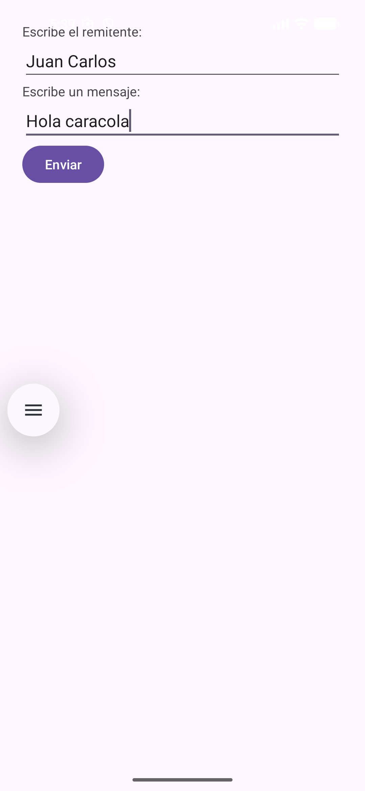
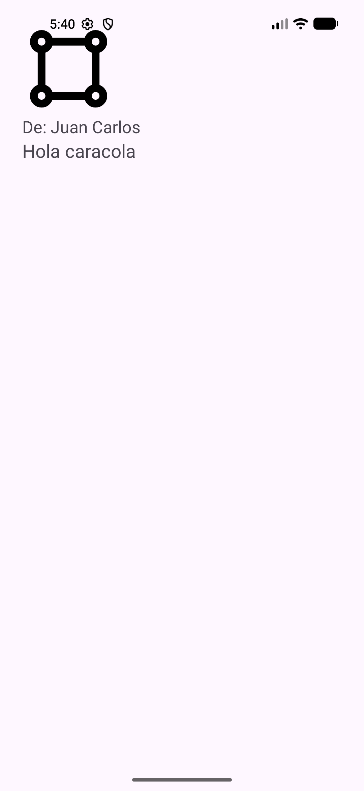
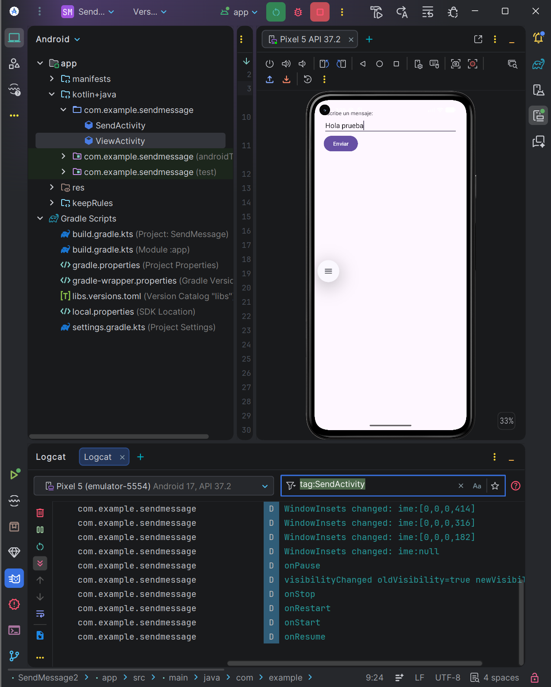

# SendMessage — aplicación Android con Kotlin y XML

Ejercicio de DEINT: una aplicación Android con dos pantallas. El usuario escribe un remitente y un mensaje en la primera, y ve ambos en la segunda junto a un icono vectorial.

El nombre «enviar» se refiere al paso de datos entre pantallas de esta aplicación. No se envían SMS ni mensajes por Internet y no se mantiene un historial.

## Descripción

Proyecto educativo para practicar la comunicación entre actividades Android, los modelos de datos serializables, el registro del ciclo de vida, las pruebas y la documentación técnica. La lógica está en Kotlin y la interfaz utiliza vistas XML.

## Aplicación en ejecución

### Escribir el mensaje



### Ver el mensaje recibido



## Características

- Formulario para escribir el nombre del remitente y el texto del mensaje.
- Apertura de la segunda pantalla al pulsar **Enviar mensaje**.
- Envío de un objeto `Message` que contiene el texto y una `Person` remitente.
- Presentación del remitente con el formato `De: nombre`, del mensaje y de un icono vectorial decorativo.
- Posibilidad de volver a la primera pantalla para realizar otro envío.
- Registro de los métodos del ciclo de vida de cada actividad en Logcat.
- Prueba unitaria de serialización y pruebas de interfaz con Espresso.
- Documentación KDoc y generación de HTML con Dokka.

## Arquitectura y tecnologías

La aplicación tiene un único módulo Android, `app`, con dos actividades y un paquete `model`. Las actividades gestionan directamente los controles mediante `findViewById`; no utiliza Jetpack Compose.

El flujo es: `SendActivity` recoge los campos, crea un `Message` con su `Person`, lo adjunta a un Intent explícito y abre `ViewActivity`. Esta recupera el objeto mediante la clave compartida `SendActivity.EXTRA_MESSAGE` y muestra sus propiedades.

| Componente | Tecnología o configuración |
| --- | --- |
| Lenguaje | Kotlin integrado en el proyecto Android. |
| Interfaz | XML, `LinearLayout` y Android Views. |
| Actividades | AndroidX AppCompat y Activity KTX. |
| Paso de datos | Intent explícito y `java.io.Serializable`. |
| Parcelize | Plugin activado; los modelos siguen usando `Serializable`, como en la actividad. |
| Compilación | Gradle Wrapper y Android Gradle Plugin del proyecto. |
| Versiones Android | `minSdk` 24, `targetSdk` 37 y `compileSdk` 37. |
| Pruebas | JUnit 4, AndroidX Test y Espresso. |
| Documentación | KDoc y Dokka 2.2.0. |
| Integración continua | GitHub Actions. |
| Publicación de documentación | Workflow preparado para GitHub Pages. |

## Comenzando

### Requisitos

- Android Studio.
- JDK compatible con la configuración de Gradle del proyecto.
- Android SDK correspondiente al `compileSdk` configurado.
- Un emulador o dispositivo Android API 24 o superior para ejecutar la aplicación y las pruebas de interfaz.
- Acceso a Internet para descargar dependencias durante la sincronización inicial.

### Instalación y ejecución

1. Clona el repositorio o descarga sus archivos:

   ```powershell
   git clone https://github.com/juancarlosdelpozo/SendMessage.git
   cd SendMessage
   ```

2. Abre el proyecto en Android Studio y deja que Gradle sincronice.
3. Inicia un emulador o conecta un dispositivo.
4. Selecciona la configuración `app` y pulsa **Run**.
5. Introduce un remitente y un mensaje, pulsa **Enviar mensaje** y comprueba que aparecen en la segunda pantalla.

También puedes compilar y ejecutar las comprobaciones principales desde PowerShell:

```powershell
.\gradlew.bat :app:testDebugUnitTest :app:assembleDebug :app:assembleDebugAndroidTest
```

Para ejecutar las pruebas de interfaz, con un emulador o dispositivo conectado:

```powershell
.\gradlew.bat :app:connectedDebugAndroidTest
```

## Módulos y estructura del proyecto

| Archivo o carpeta | Función |
| --- | --- |
| `app/src/main/java/com/example/sendmessage/SendActivity.kt` | Recoge remitente y texto y envía el objeto `Message`. |
| `app/src/main/java/com/example/sendmessage/ViewActivity.kt` | Recupera el objeto y muestra remitente y texto. |
| `app/src/main/java/com/example/sendmessage/model/` | Clases serializables `Person` y `Message`. |
| `app/src/main/res/layout/activity_send.xml` | Campos para remitente y mensaje, más el botón de envío. |
| `app/src/main/res/layout/activity_view.xml` | Remitente, texto recibido e imagen. |
| `app/src/main/res/values/` | Cadenas, colores, dimensiones, estilos y temas. |
| `app/src/test/` | Pruebas unitarias locales. |
| `app/src/androidTest/` | Pruebas de interfaz que requieren emulador o dispositivo. |
| `screenshots/` | Capturas actuales de las dos pantallas. |
| `documentacion/imagenes/` | Evidencias visuales del proyecto. |
| `.opencode/skills/` | Skills de documentación/licencia proporcionadas en clase. |

## Decisiones de diseño

- La interfaz está declarada en XML y la lógica está escrita en Kotlin.
- Las dos pantallas utilizan un `LinearLayout` vertical.
- Se conserva `SendActivity` como pantalla de envío y `ViewActivity` como pantalla de destino.
- `findViewById` localiza los campos `edtRemitente` y `edtMensaje` y el botón `btnSend`.
- Los textos se leen al pulsar el botón. Se crea un `Message` que contiene el texto y una `Person` remitente. Ambas clases implementan `Serializable`.
- Un Intent explícito indica la actividad de destino y `putExtra` adjunta el objeto.
- Cadenas, colores y dimensiones se guardan en recursos. El estilo `MessageText` comparte tipografía, tamaño y color.
- El icono de chat de la segunda pantalla es decorativo y no es el icono de lanzamiento.
- Los comentarios KDoc documentan las actividades, la clave del extra, los modelos y los métodos del ciclo de vida.

## Pruebas y comprobaciones

`MessageSerializationTest` comprueba que la serialización conserva el mensaje y su remitente. `MessageFlowTest` comprueba el envío de ambos campos, el icono, el regreso al formulario y el comportamiento con campos vacíos.

La compilación debug, las pruebas unitarias y la compilación de las pruebas instrumentadas ya se habían comprobado correctamente antes de esta actualización. Tras integrar los cambios de clase conviene repetir las tareas indicadas arriba y ejecutar `connectedDebugAndroidTest` con un emulador disponible.

## Depuración y evidencia de Logcat

Las actividades utilizan los TAG `SendMessage.Send` y `SendMessage.View` y registran `onCreate`, `onStart`, `onResume`, `onPause`, `onStop`, `onRestart` y `onDestroy`.



## Documentación y versiones

- [Manual de usuario](MANUAL_USUARIO.md).
- [Historial de cambios](CHANGELOG.md).
- Documentación KDoc incluida en los ficheros Kotlin.
- Dokka está configurado para generar la documentación HTML en `docs/`.
- El workflow `.github/workflows/desplegar-dokka.yml` está preparado para generar Dokka y publicar la documentación mediante GitHub Pages.
- [Repositorio en GitHub](https://github.com/juancarlosdelpozo/SendMessage).
- Página prevista para la documentación: <https://juancarlosdelpozo.github.io/SendMessage/>.

Para regenerar el HTML local:

```powershell
.\gradlew.bat :app:dokkaGeneratePublicationHtml
```

## APK firmado

El proyecto incluye en la raíz `app-release.apk`, copia del APK release firmado generado durante la actividad. El almacén de claves privado no se incluye en el repositorio.

## Licencia y contacto

Autor del proyecto: **Juan Carlos del Pozo**.

Contacto y consultas: [perfil de GitHub](https://github.com/juancarlosdelpozo).

El proyecto no incluye actualmente un archivo `LICENSE` ni una licencia explícita para su código. No se atribuye automáticamente una licencia MIT, Apache u otra.

## Referencias oficiales

- [Intents y filtros de intents](https://developer.android.com/guide/components/intents-filters).
- [Ciclo de vida de una actividad](https://developer.android.com/guide/components/activities/activity-lifecycle).
- [Consultar registros con Logcat](https://developer.android.com/studio/debug/logcat).
- [Inspeccionar archivos con Device Explorer](https://developer.android.com/studio/debug/device-file-explorer).
